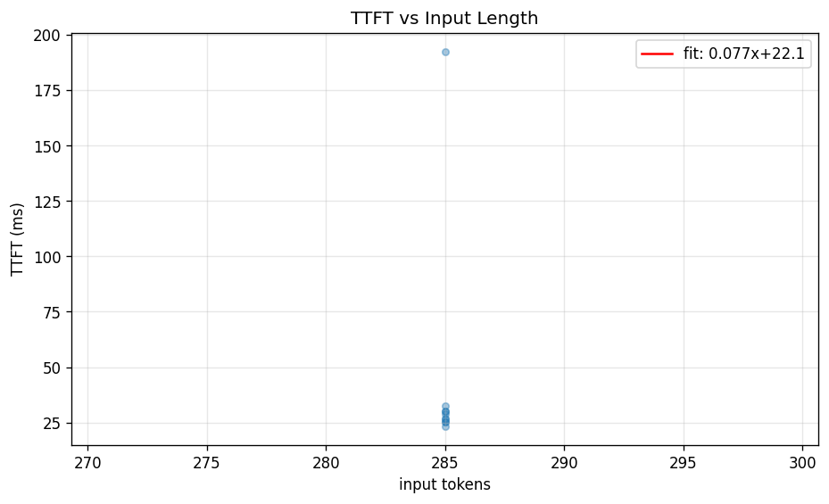

# Run Report — `01KPN3QMWG4XHM8C0K2K7ANY5W`

- **Profile**: `smoke-guidellm`
- **Endpoint**: `local-vllm-smoke`
- **Generated**: 2026-04-20T18:33:07
- **Total requests (rows)**: 10

## Metrics
| metric | p50 | p95 | p99 | avg |
|:-------|----:|----:|----:|----:|
| e2e | 0.60 | 0.76 | 0.76 | 0.61 |
| itl | 9.03 | 9.04 | 9.04 | 9.02 |
| throughput_req | 1.99 | 2.38 | 4.01 | 1.96 |
| throughput_tok | 110.78 | 222.36 | 236.59 | 130.44 |
| tpot | 9.30 | 11.86 | 11.86 | 9.57 |
| ttft | 26.80 | 192.48 | 192.48 | 44.15 |

## ttft_vs_input_len

