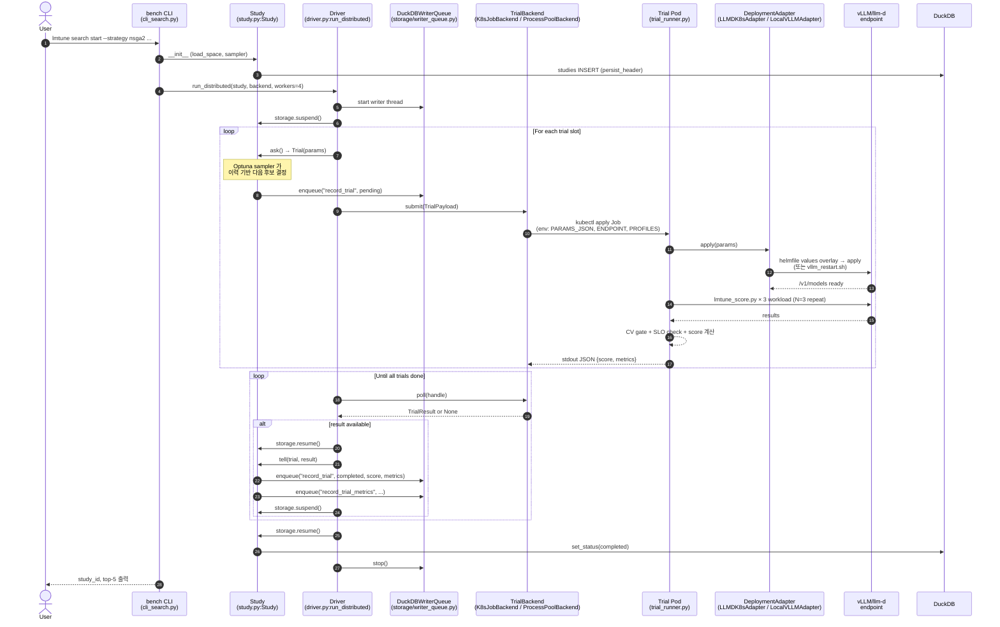

# Autotune Loop — 실행 흐름 도식 (single source of truth)

> Phase B-I 산출물. `lmtune search` 의 **사용자 / 시스템 / trial / continuous** 4 관점 sequence diagram + 코드 경로 인용. 이후 phase 가 axis/path 추가 시 본 문서를 갱신·누적한다.

본 프로젝트의 autotune 사이클은 4 계층으로 분리된다. 위에서 아래로 읽으면 사용자 한 줄 명령이 어떻게 분산 K8s Job 으로 풀려서 다시 DuckDB 에 누적되는지 한눈에 파악할 수 있다.

| 관점 | 누구의 시점 | 핵심 파일 |
|:---|:---|:---|
| 1. 사용자 | YAML 작성 → CLI 한 줄 | `b200/search-spaces/`, `b200/endpoints/`, `configs/profiles/autotune/` |
| 2. 시스템 | Driver 가 Trial 을 분산 dispatch | `src/bench/orchestrate/driver.py`, `backend_k8s.py`, `writer_queue.py` |
| 3. Trial 단위 | sampler.ask → submit → poll → tell | `src/bench/search/study.py`, `samplers/`, `objective.py` |
| 4. Continuous | cron 으로 새 cycle 시작 + warm-start + git commit | `b200/scripts/loop.sh` (B5 산출), `lmtune search resume` |

---

## 1. 사용자 시점 — 입력 YAML 3종 + CLI 한 줄

### 입력 1 — SearchSpace (탐색할 axis 정의)

```yaml
# b200/search-spaces/b1_baselines.yaml
apiVersion: lmtune/search/v1alpha1
kind: SearchSpace
name: b1-baselines

axes:
  # 모델·path 카테고리
  model_id: {type: categorical, values: [llama-3.1-8b, qwen2.5-72b, qwen3-235b]}
  well_lit_path: {type: categorical, values: [inference-scheduling, pd, wide-ep]}

  # vLLM engine_args
  max_num_seqs: {type: categorical, values: [32, 64, 128, 256]}
  enable_prefix_caching: {type: bool}
  gpu_memory_utilization: {type: float, low: 0.80, high: 0.92}

  # parallelism (active_if 로 조합 게이팅)
  tensor_parallel_size: {type: categorical, values: [1, 2, 4, 8]}
  pipeline_parallel_size: {type: categorical, values: [1, 2]}
```

### 입력 2 — Endpoint (어디서 서빙되는지)

```yaml
# b200/endpoints/b200_smoke.yaml
slug: b200-smoke
url: http://infra-infsch-inference-gateway.b200-infsch.svc/v1
model: meta-llama/Llama-3.1-8B-Instruct
deployment:
  engine: vllm
  engine_args: {}    # ← trial 마다 sampler 가 채움
```

### 입력 3 — Profile × 3 (어떻게 부하 줄지)

```yaml
# configs/profiles/autotune/short.yaml (medium.yaml, long.yaml 도 동일 구조)
runner: guidellm
workload:
  input_tokens: 256
  output_tokens: 128
  concurrency: 8
  num_requests: 30
slo:
  ttft_p99_ms: 500
  e2e_p99_ms: 30000
  failure_rate: 0.01
```

### CLI 한 줄

```bash
lmtune search start \
  --strategy nsga2 \
  --space b200/search-spaces/b1_baselines.yaml \
  --endpoint b200/endpoints/b200_smoke.yaml \
  -p configs/profiles/autotune/short.yaml \
  -p configs/profiles/autotune/medium.yaml \
  -p configs/profiles/autotune/long.yaml \
  --backend k8s-job --workers 4 \
  --max-trials 40 \
  --objectives "throughput_tok.avg:short:maximize,ttft.p99:short:minimize" \
  --name B1-llama8b
# → study_id=st-01KXX...
```

### 출력 결과 위치

| 위치 | 무엇이 |
|:---|:---|
| `data/db/lmtune.duckdb` | `studies` / `trials` / `trial_metrics` / `runs` / `metrics` 테이블 |
| `data/raw/<run_id>/` | guidellm raw artifact |
| `lmtune search status <study_id>` | 진행률 + top-5 + Pareto front |
| `b200/studies/<study_id>/ANALYSIS.md` | 사용자(또는 auto-mode) 가 작성하는 분석 문서 |

---

## 2. 시스템 시점 — Driver / Backend / Adapter sequence (Mermaid)



### ASCII fallback (터미널 친화)

```
┌──────────────────── Driver process (단일) ─────────────────────┐
│                                                                  │
│  ① CLI → Study.__init__   (DuckDB studies INSERT)               │
│  ② run_distributed():                                           │
│       storage.suspend()    ← DB lock 해제                       │
│       writer_queue start                                        │
│                                                                  │
│  ┌─ ask 루프 (workers 만큼) ─────────────────────────────────┐ │
│  │  trial = study.ask()       ← sampler 가 이력 기반 결정     │ │
│  │  payload = TrialPayload(params, endpoint, profiles)       │ │
│  │  handle = backend.submit(payload)                          │ │
│  │     K8sJobBackend.submit → kubectl apply Job              │ │
│  │     ProcessPoolBackend.submit → Future                    │ │
│  └────────────────────────────────────────────────────────────┘ │
│                                                                  │
│  ┌─ poll 루프 ──────────────────────────────────────────────┐  │
│  │  while inflight:                                          │  │
│  │    res = backend.poll(handle)  ← Job log tail JSON 파싱  │  │
│  │    if res:                                                │  │
│  │      storage.resume()                                     │  │
│  │      study.tell(trial, res)  ← Optuna feedback + DB write│  │
│  │      storage.suspend()                                    │  │
│  └────────────────────────────────────────────────────────────┘ │
│                                                                  │
│  storage.resume() → set_status(completed) → writer_queue stop   │
└──────────────────────────────────────────────────────────────────┘
        ↕ (각 trial Pod 안에서, 독립 process)
┌────────────── Trial Pod (K8s Job) ───────────────────────────────┐
│  trial_runner._main_k8s()                                        │
│    env 에서 PARAMS_JSON / ENDPOINT_PATH / PROFILE_PATHS 읽기     │
│    ① DeploymentAdapter.apply(params)                             │
│       LLMDK8sAdapter: helmfile values overlay → apply            │
│       LocalVLLMAdapter: scripts/vllm_restart.sh 호출             │
│       /v1/models probe 로 ready 확인                             │
│    ② BenchScoreObjective(params)  ← scripts/lmtune_score.py 호출 │
│       for workload in [short, medium, long]:                     │
│         for repeat in 1..3:                                      │
│           lmtune run → DuckDB runs/metrics                        │
│         CV(throughput) ≥ 0.10 → 5 repeat 확장 1회                │
│         SLO 위반 → score=0 (탈락)                                │
│         else composite score = throughput × penalty(ttft)        │
│    ③ stdout JSON {trial_id, score, metrics, slo_pass}            │
│       → Driver 가 tail/parse                                     │
└──────────────────────────────────────────────────────────────────┘
```

### 핵심 코드 경로

| 단계 | 파일:라인 | 함수/클래스 |
|:---|:---|:---|
| CLI 진입 | `src/bench/cli_search.py:40` | `cmd_start` |
| Study 생성 | `src/bench/search/study.py:56` | `Study.__init__` |
| Sampler 생성 | `src/bench/search/samplers/__init__.py:60` | `make_sampler` |
| 분산 실행 진입 | `src/bench/orchestrate/driver.py:37` | `run_distributed` |
| Trial 샘플 | `src/bench/search/study.py:126` | `Study.ask` |
| Trial 결과 반영 | `src/bench/search/study.py:150` | `Study.tell` |
| K8s Job 제출 | `src/bench/orchestrate/backend_k8s.py:126` | `K8sJobBackend.submit` |
| K8s Job poll | `src/bench/orchestrate/backend_k8s.py:135` | `K8sJobBackend.poll` |
| Trial Pod entry | `src/bench/orchestrate/trial_runner.py` | `_main_k8s` |
| Score 계산 | `scripts/lmtune_score.py` | composite + CV gate + SLO |
| Helmfile 적용 | `src/bench/deploy/llmd_k8s.py` | `LLMDK8sAdapter.apply` |
| DB write 직렬화 | `src/bench/storage/writer_queue.py:31` | `DuckDBWriterQueue` |

---

## 3. Trial 단위 시점 — sampler.ask → submit → poll → tell (algorithm detail)

### sampler.ask 의 내부 — sampler 별 차이

| Sampler | 알고리즘 | 다음 trial 결정 방법 | 적합 용도 |
|:---|:---|:---|:---|
| **Grid** (`grid.py`) | 격자 전수 | 미방문 격자점 순서대로 | discrete, axis 적을 때 baseline |
| **Random** (`random.py`) | 균등 분포 | RNG 균등 샘플 | warm-start 없는 초기 탐색 |
| **LHC** (`lhc.py`) | Latin Hypercube | scipy `qmc.LatinHypercube` 가 격자 균등 분배 → batch 반환 | 균등 coverage 가 중요한 초기 탐색 |
| **TPE** (`tpe.py`) | Tree Parzen Estimator | 과거 trial 을 score 상하위로 분할 → P(good\|x)/P(bad\|x) 비율 최대점 선택 | Bayesian 이력 기반 (가장 일반적) |
| **CMA-ES** (`cma_es.py`) | Covariance Matrix Adaptation Evolution Strategy | 다변량 정규분포의 평균·covariance 를 trial 결과로 적응 | 연속 공간 다축 최적화 |
| **NSGA-II** (`nsga2.py`) | 진화 알고리즘 + non-dominated sort + crowding distance | 비지배 정렬로 ranking, crowding distance 로 다양성 보존 → mutation/crossover | **Multi-objective Pareto front** |
| **UCB Bandit** (`ucb_bandit.py`) | Upper Confidence Bound | categorical axis 에 한정. mean + sqrt(2 ln N / n_i) 최대 arm 선택 | 학습용 자체 구현 |

코드 위치: `src/bench/search/samplers/{grid,random,lhc,tpe,cma_es,nsga2,ucb_bandit}.py`

### Trial 결과의 score 계산 (`scripts/lmtune_score.py`)

```
for workload in [short, medium, long]:
  for repeat in 1..N (default N=3):
    lmtune run  → metrics (ttft.p99, throughput.avg, e2e.p99, fail_rate)
  CV(throughput) = stddev / mean
  if CV ≥ 0.10:
    repeat with N=5 (확장 재측정 1회)
    if still CV ≥ 0.10:
      accepted = false   # 노이즈, score=0
      continue
  # SLO check (per-workload)
  if ttft.p99 > 500ms or e2e.p99 > 30s or fail_rate > 1%:
    workload_score = 0
  else:
    penalty = max(0, 1 - ttft.p99 / (2 × 500ms))
    workload_score = throughput.avg × penalty
total_score = sum(workload_scores)  # 3 workloads 합산
```

### tell 의 내부

```python
# study.py:150
def tell(self, trial: Trial, result: ObjectiveResult):
    # 1. Optuna 에 (params, score) 피드백
    self._optuna_study.tell(trial._optuna_trial, result.score)
    # 2. DuckDB 에 trial 결과 기록 (writer_queue 경유)
    self._writer_queue.enqueue("record_trial", trial.id, status="completed", score=result.score, ...)
    self._writer_queue.enqueue("record_trial_metrics", trial.id, result.metrics)
```

---

## 4. 재현성 게이트 + Continuous loop

### 재현성 게이트 — N=3 + CV gate + SLO

본 프로젝트가 hyperparameter search 방향에서 다른 OSS 와 다른 점은 **단일 측정을 절대 신뢰하지 않는다**는 것:

```
trial config → lmtune run × 3 (default repeats=3)
             → CV(throughput) 계산
             → ≥ 0.10 (10%) 이면 확장 재측정 1회 (N=5)
             → 여전히 ≥ 0.10 이면 reject (노이즈)
             → ≤ 0.10 이면 평균 → SLO check → composite score
```

이 게이트가 없으면 noise 가 큰 trial 이 sampler 를 잘못 학습시켜 수렴이 안 된다. 본 게이트가 plan 의 "differentiation 5점" 중 하나.

### Continuous loop (Phase B5 산출)

```bash
# b200/scripts/loop.sh — N 시간 budget 으로 한 cycle 실행
#!/usr/bin/env bash
SPACE="b200/search-spaces/b2_vllm_engine.yaml"
ENDPOINT="b200/endpoints/b200_smoke.yaml"
WARM="data/db/lmtune.duckdb"
BUDGET_HOURS=4

lmtune search start \
  --strategy nsga2 \
  --space "$SPACE" \
  --endpoint "$ENDPOINT" \
  -p configs/profiles/autotune/short.yaml \
  -p configs/profiles/autotune/medium.yaml \
  -p configs/profiles/autotune/long.yaml \
  --warmstart-db "$WARM" \
  --budget-hours "$BUDGET_HOURS" \
  --backend k8s-job --workers 4

# 종료 직후 자동:
STUDY_ID=$(grep -oE 'st-[A-Z0-9]+' /tmp/last_search.log | head -1)
lmtune search status "$STUDY_ID" > b200/studies/${STUDY_ID}/status.txt
lmtune search pareto "$STUDY_ID" --out b200/studies/${STUDY_ID}/pareto.png

# 회귀 alert (직전 baseline 대비 ≥ 5% 하락)
python b200/scripts/regression_check.py "$STUDY_ID" \
  --baseline data/archive/B1_winner.duckdb \
  --threshold 0.05 \
  --out b200/docs/regression_alerts.md

# git auto-commit
git add b200/studies/${STUDY_ID}/ b200/docs/winning_configs.md b200/docs/regression_alerts.md
git commit -m "B5: $(date +%F) ${STUDY_ID} top-3 archived"
```

cron 또는 ScheduleWakeup 으로 일·주 단위 trigger.

### 외부 LLM 에이전트 통합 (Phase S6, B-phase 와 병렬)

autoresearch 는 외부 Claude Code 스킬이고, 본 repo 에 3 인터페이스(`autoresearch.{md,sh}` + `autoresearch.jsonl`) 를 통해 연결된다. S6 후 통합 흐름:

```
autoresearch agent (Claude)
   ├─ autoresearch.md 읽기 (goal, constraints, history)
   ├─ lmtune search ask <study_id> --json     ← S6 신규
   │    Optuna sampler 가 추천한 params JSON 반환
   ├─ params 를 endpoint YAML 에 적용
   ├─ ./autoresearch.sh                      ← bench_score × 3 → METRIC stdout
   └─ lmtune search tell <study_id> --trial X --metrics-json results.json   ← S6 신규
        Optuna feedback + DuckDB write
```

→ **LLM 의 도메인 지식** (자연어 reasoning) + **Optuna 의 통계 효율** 결합. autoresearch 자체 가설 생성 0줄.

---

## 5. 사용자가 알아서 / 시스템이 알아서 — 한눈

| 단계 | 사용자 | 시스템 |
|:---|:---|:---|
| 1. SearchSpace YAML 작성 | ✅ axis 정의 + active_if | — |
| 2. Endpoint/Profile YAML | ✅ HW/모델/SLO 입력 | — |
| 3. `lmtune search start` | ✅ 한 번 실행 | — |
| 4. Trial params 결정 | — | ✅ Optuna sampler |
| 5. Helmfile 배포 | — | ✅ LLMDK8sAdapter |
| 6. 부하 측정 (3 repeat) | — | ✅ lmtune_score.py |
| 7. CV/SLO 게이트 | — | ✅ Objective wrapper |
| 8. DB 적재 (writer queue) | — | ✅ DuckDBWriterQueue |
| 9. Pareto / Sobol 분석 | ✅ 명령 1줄 (`pareto`/`sensitivity`) | ✅ 계산 + plot |
| 10. axis 축소 권고 | ✅ `prune --apply` | ✅ ANOVA + RF |
| 11. Continuous 재실행 | ✅ cron 등록 1회 | ✅ loop.sh |
| 12. **결과 분석 문서화** | ✅ `ANALYSIS.md` 작성 — 원인·의의·다음 가설 | (auto-mode 가 초안 보조 가능) |

---

## 6. 본 문서의 갱신 규칙

이후 phase 가 새 axis/sampler/path 를 추가할 때마다 본 문서의 다음 섹션을 갱신:

- **§2 시스템 시퀀스** — 새 component (예: B7 의 `EngineBackend`, B6 의 `system_capture` hook) 추가 시 sequence diagram 갱신
- **§3 sampler 표** — 새 native sampler / 새 pruner 추가 시 행 추가
- **§4 continuous loop** — B5 의 loop.sh 가 발전할 때 (예: 다중 study 병렬, multi-tenant fairness 측정 결합) 반영

본 문서 = autotune 사이클의 **single source of truth**. 코드 변경 시 본 문서도 함께 갱신해야 한다 (PR review 의 체크 항목).

---

## References (구체적 코드 위치)

- `src/bench/search/study.py` — Study, Trial, ask/tell
- `src/bench/search/samplers/` — 7 sampler 구현
- `src/bench/search/objective.py` — `Objective` Protocol, `BenchScoreObjective`
- `src/bench/search/objective_pareto.py` — multi-obj wrapper (NSGA-II 용)
- `src/bench/search/analysis/{anova,importance,bound_tighten,sobol}.py` — pruner + sensitivity
- `src/bench/orchestrate/driver.py` — `run_distributed`
- `src/bench/orchestrate/backend.py` — `TrialBackend` ABC, `TrialPayload`, `TrialResult`
- `src/bench/orchestrate/backend_k8s.py` — K8s Job per trial
- `src/bench/orchestrate/backend_process_pool.py` — local fallback
- `src/bench/orchestrate/writer_queue.py` (`storage/writer_queue.py`) — DuckDB single-writer
- `src/bench/orchestrate/trial_runner.py` — Pod 내부 entry point
- `src/bench/deploy/llmd_k8s.py` — helmfile adapter
- `src/bench/deploy/local_vllm.py` — vllm_restart.sh wrapper
- `src/bench/cli_search.py` — `lmtune search {start, status, resume, prune, pareto, sensitivity}`
- `scripts/lmtune_score.py` — score 계산 + CV gate + SLO check
- `scripts/vllm_restart.sh` — engine_args → CLI flags 변환
- `k8s/trial-job-template.yaml` — Trial Job 매니페스트
- `docker/Dockerfile.trial_runner` — Trial Pod 이미지

및 외부 reference:
- `(internal dev plan, not in repo)` — 전체 plan
- `docs/search_tooling_2026-04.md` — 도구 선택 근거 (Optuna/SALib/BoTorch)
- 유사 OSS 비교: plan 파일의 "참고 — 유사 / 비교 OSS 프로젝트" 섹션
